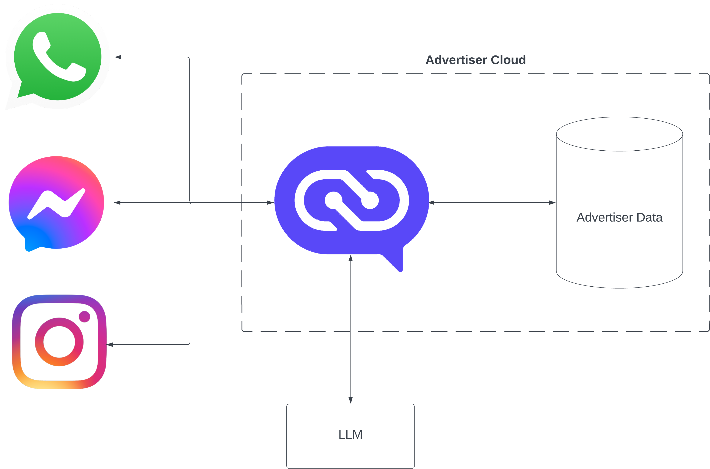

# Introduction

Conversational Platform for Marketing (CP4M) is a middleware service which enables developers to easily integrate their user-facing LLM chatbots with messaging platforms like Whatsapp and Facebook Messenger. CP4M can help scale your chatbot's traffic to billions of people globally **in less than an hour** of development time.



## Getting Started

 Clone the open source project from [GitHub](https://github.com/facebookincubator/CP4M).

```bash
git clone git@github.com:facebookincubator/CP4M.git
```


### Set up your configuration file

1. Create an empty file
```bash
mkdir /tmp/cp4m
touch /tmp/cp4m/cp4m.toml
```

2. Copy the relevant configuration contents into your file

**Example: Whatsapp w/ OpenAI**
```bash
port = 8080

[[plugins]]
name = "openai_test"
type = "openai"
model = "gpt-3.5-turbo"
api_key = "<your api key here>"

[[stores]]
name = "memory_test"
type = "memory"
storage_duration_hours = 1
storage_capacity_mbs = 1

[[handlers]]
type = "whatsapp"
name = "whatsapp_test"
verify_token = "<your verification token here>"
app_secret = "<your verification app secret here>"
access_token = "<you access token here>"

[[services]]
webhook_path = "/<your webhook pathname here>"
plugin = "openai_test"
store = "memory_test"
handler = "whatsapp_test"
```


**Example: Messenger & Whatsapp w/ Llama 2 (via Hugging Face)**
```bash
port = 8080

[[plugins]]
name = "hf_test"
type = "hugging_face"
endpoint = "<your hugging face api url here>"
token_limit = 1000
api_key = "<your hugging face api key here>"

[[stores]]
name = "memory_test"
type = "memory"
storage_duration_hours = 1
storage_capacity_mbs = 1

[[handlers]]
name = "messenger_test"
type = "messenger"
verify_token = "<your messenger verification token here>"
app_secret = "<your messenger verification app secret here>"
page_access_token = "<your messenger page access token here>"

[[handlers]]
name = "whatsapp_test"
type = "whatsapp"
verify_token = "<your verification token here>"
app_secret = "<your verification app secret here>"
access_token = "<you access token here>"

[[services]]
webhook_path = "/<your webhook pathname here>"
plugin = "hf_test"
store = "memory_test"
handler = "messenger_test"

[[services]]
webhook_path = "/<your webhook pathname here>"
plugin = "hf_test"
store = "memory_test"
handler = "whatsapp_test"
```


For help finding tokens & secrets for your app in the handlers section, please go to the relevant messaging page in [Messaging Integrations](./category/messaging-integrations). For help finding the api_key for your LLM plugin, please go to the relevant LLM page in [LLM Connections](./category/connecting-your-llm).

If there is another LLM plugin not listed above that you would like to use, please contact cp4m@meta.com.

### Build and Run CP4M via Docker

```bash
docker build -t cp4m .
docker run -v /tmp/cp4m:/tmp/cp4m -e CP4M_CONFIGURATION_FILE=/tmp/cp4m/cp4m.toml -p 8080:8080 cp4m
```
