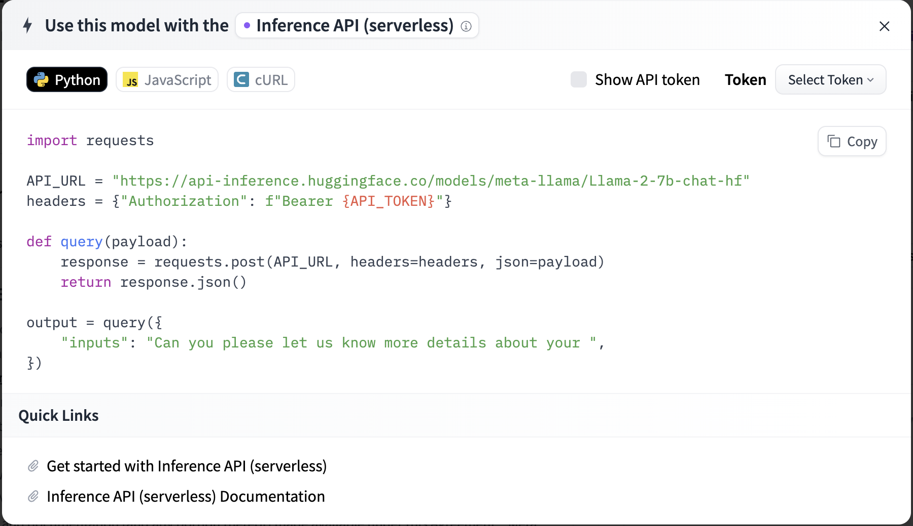
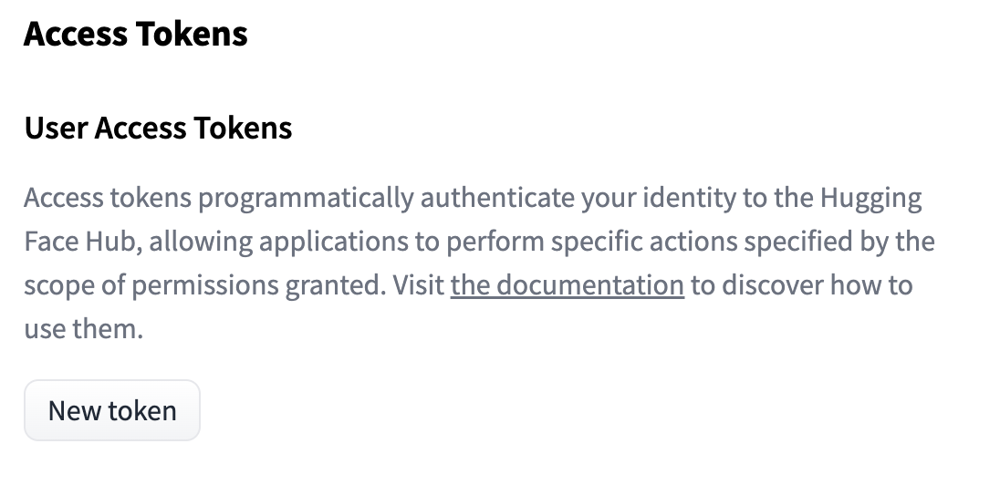
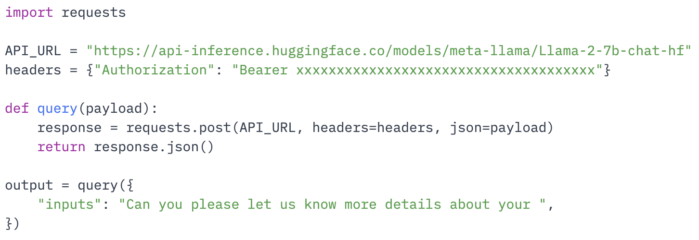

# Connecting to Llama via Hugging Face

To connect CP4M to Llama via Hugging Face, you will need:
1. A Hugging Face account
2. Access to the Llama model from Meta

## Sign up for a Hugging Face account
Hugging Face is a platform that helps you build, deploy, and train machine learning models. You can sign up for an account [here](https://huggingface.co/join).

## Accessing the Llama model on Hugging Face
Hugging Face has a large repository of machine learning models for a variety of use cases accessible [here](https://huggingface.co/models).

You can search for the LLama model from Meta of your choice. For the purposes of this tutorial, we will be using the [LLama-2-7b-chat-hf model](https://huggingface.co/meta-llama/Llama-2-7b-chat-hf).

In order to use the Llama model, you will need to accept the Llama 2 Community License Agreement on the [model page](https://huggingface.co/meta-llama/Llama-2-7b-chat-hf).

Once your account is approved, the model page will inform you that you have been granted access.

## Deploying model using Inference API
The fastest way to deploy Llama is through Hugging Face's serverless Inference API.

1. Go to the [Llama model page](https://huggingface.co/meta-llama/Llama-2-7b-chat-hf).
2. On the top right, click on the **Deploy** dropdown button.

3. In the dropdown, click the **Inference API (serverless)** option. *Note: Using Inference API requires a [Hugging Face Pro subscription](https://huggingface.co/pricing)*.

4. On the new modal, click the **Token** dropdown then click **+ New access token**.

5. On the access tokens page, click the **New Token** button.

6. Create a new access token with the **Write** permission.

7. Go back to the Model Deploy > Inference API page [here](https://huggingface.co/meta-llama/Llama-2-7b-chat-hf?inference_api=true). Your newly created access token should now be populated in the **Token** section.

## Updating your CP4M config from Inference API
7. Copy and paste the *API_URL* on the Deploy Inference API modal to your CP4M config file in the "\[\[plugins]] endpoint" entry. If you are using the Llama-2-7b-chat-hf model, it should be "https://api-inference.huggingface.co/models/meta-llama/Llama-2-7b-chat-hf".

8. Click **Show API token**. Copy and paste this API token to your CP4M config file in the "\[\[plugins]] api_key" entry.

Congratulations! You have now successfully set up CP4M with Llama via Hugging Face.
