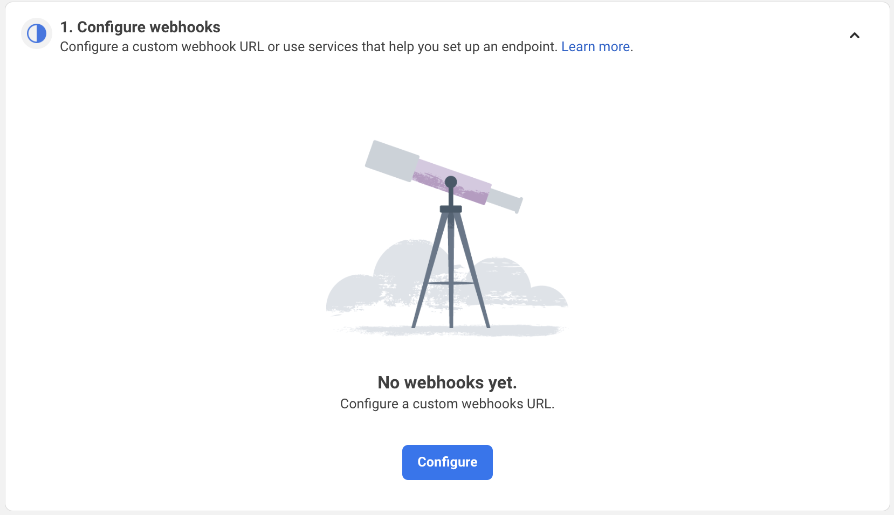
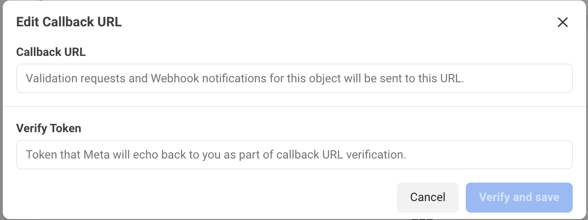
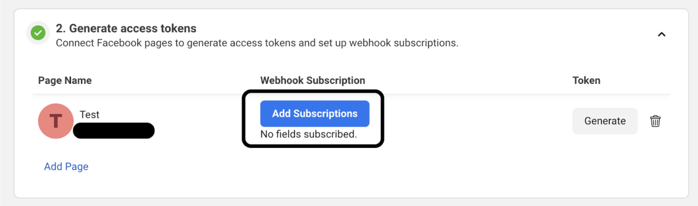
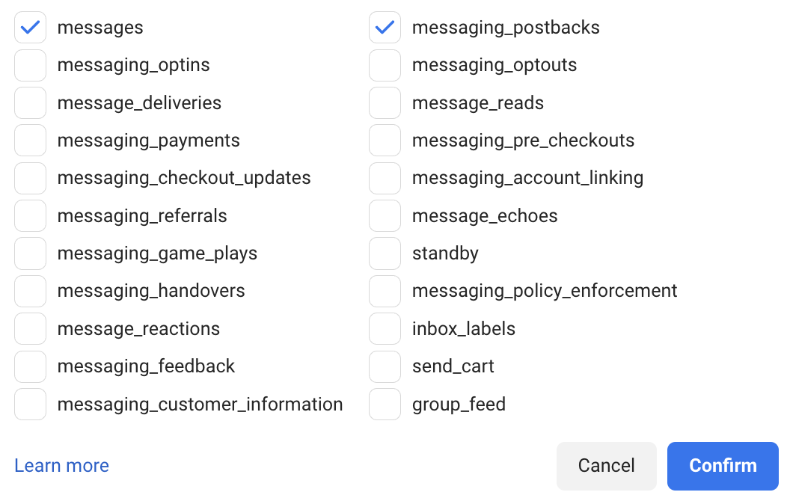

# Connecting to Messenger

To connect CP4M to Facebook Messenger, you will need:
1. A Facebook account registered as a Meta developer
1. A Meta app to integrate with Meta APIs
2. A Facebook Page for users to interact with over Messenger

## Getting Meta developer access
To register as a Meta developer, you can follow the steps [here](https://developers.facebook.com/docs/development/register).

## Creating a Meta app
You can see all of your existing Meta developer apps in the [Meta Developer App Dashboard](https://developers.facebook.com/apps/).

To create a new app, click on the **Create App** button. The steps for the app creation process are detailed [here](https://developers.facebook.com/docs/development/create-an-app).

## Create a Facebook page
If you don't already have a Facebook page for Messenger interactions, you can follow the steps [here](https://www.facebook.com/business/help/1199464373557428?id=418112142508425) to create a new page.

## Enabling Messenger API Access on your Meta app
In the [Meta Developer App Dashboard](https://developers.facebook.com/apps/):
1. Click on your Meta app
2. On the **Dashboard** page, find the **Add products to your app** section.
3. On the **Messenger** tile, click the **Set up** button.

4. On the "1. Configure webhooks" section, click the **Configure** button.

5. Follow the steps in the [Messenger Webhooks documentation](https://developers.facebook.com/docs/messenger-platform/webhooks) to configure the Callback URL and Verification Token for your server.

6. On the "2. Generate access tokens" section, click the **Add Subscriptions** button on an existing Facebook page which you would like your app to have Messenger API access.

7. At minimum, select the following Page Subscriptions. Learn more about all the Page Subscription options [here](https://developers.facebook.com/docs/messenger-platform/webhooks#subscribe-to-meta-webhooks):
a. messages
b. messaging_postbacks

8. Click the **Confirm** button to save your page subscription choices.

9. Finally, on the "3. Complete App Review" section, follow the steps to complete the App Review process so that your app can access production data. You can learn more about Meta's app review process [here](https://developers.facebook.com/docs/resp-plat-initiatives/app-review).
